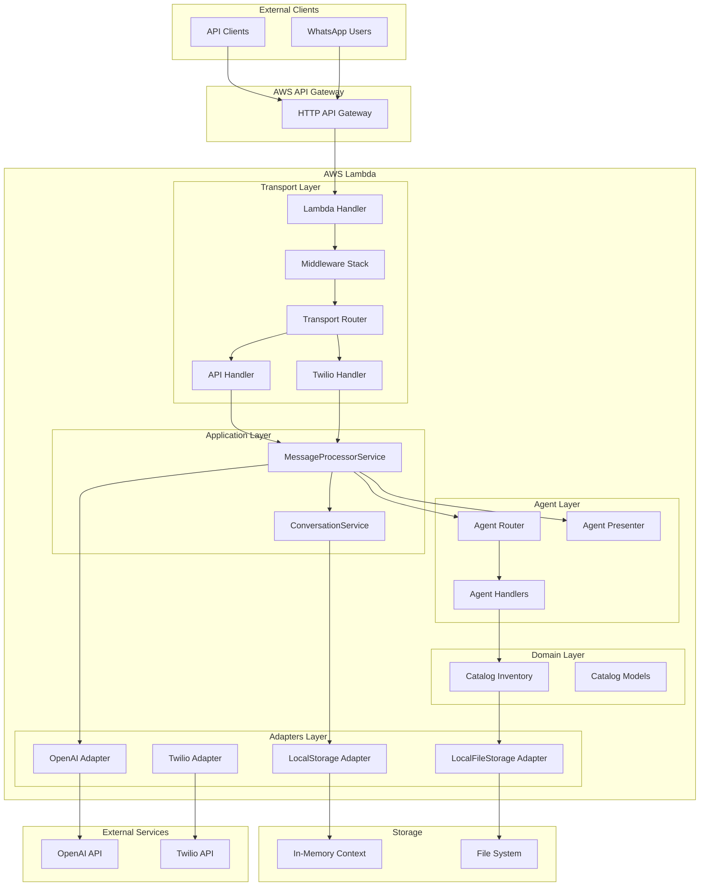
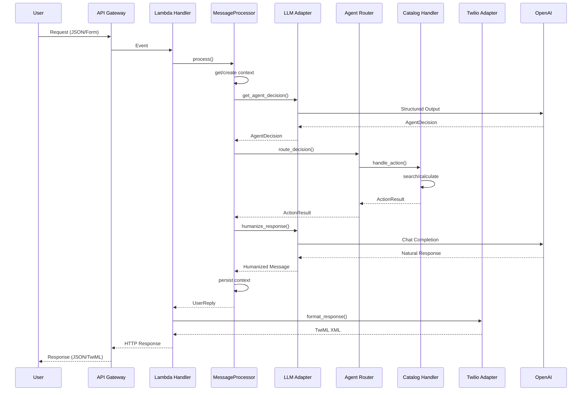
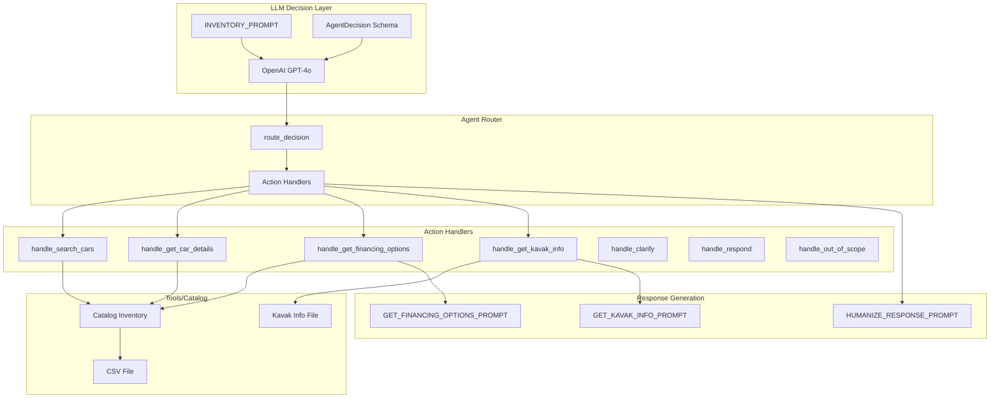
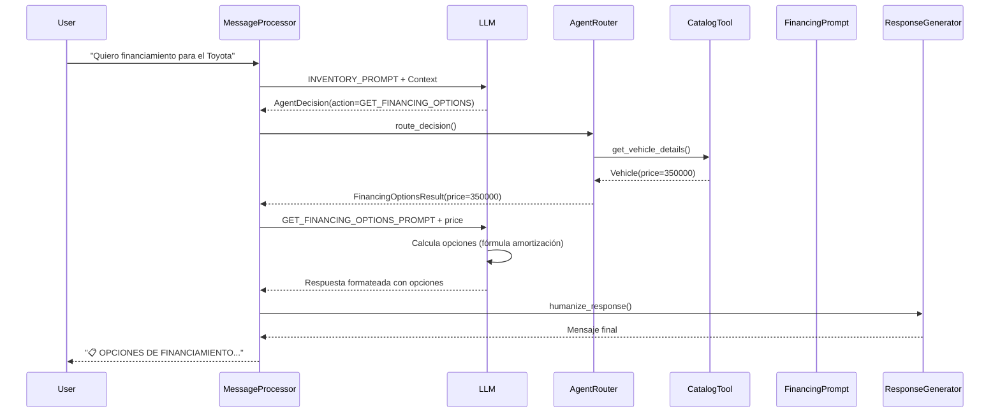

# Architecture Decision Record (ADR)
## Kavak AI Commercial Agent

**Fecha:** 2025-12-26  
**Autor:** Francisco Ocampo  
**Estado:** Propuesta Técnica  
**Versión:** 1.0  
**Repositorio:** [https://github.com/pacocampo/ai-agent](https://github.com/pacocampo/ai-agent)

---

## 1. Resumen Ejecutivo

Este documento describe la arquitectura, diseño y roadmap del **Kavak AI Commercial Agent**, un bot conversacional impulsado por LLMs que actúa como asesor comercial de Kavak. El sistema permite a los usuarios buscar vehículos, consultar información sobre Kavak y obtener opciones de financiamiento a través de múltiples canales (API REST y WhatsApp).

**Repositorio del Proyecto**: [https://github.com/pacocampo/ai-agent](https://github.com/pacocampo/ai-agent)

### 1.1 Decisiones Arquitectónicas Clave

- **Arquitectura Hexagonal (Ports & Adapters)**: Separación clara entre lógica de negocio y servicios externos
- **Multi-transporte**: Handler único que soporta API REST y WhatsApp (Twilio)
- **LLM como Orquestador**: Uso de OpenAI para decisiones estructuradas y generación de respuestas
- **Cálculo de Financiamiento vía LLM**: Decisión de demostración técnica (no recomendada para producción)

### 1.2 Funcionalidades Descartadas por Tiempo

Las siguientes funcionalidades fueron consideradas pero descartadas por limitaciones de tiempo en la prueba técnica:

- **Cache**: Sistema de caché para respuestas frecuentes y contexto de conversación (Redis/ElastiCache)
- **LangChain Supervisor**: Orquestación de múltiples agentes especializados usando LangChain
- **Auditorías**: Sistema de logging y auditoría de todas las interacciones y decisiones del agente
- **Auth de Endpoints**: Autenticación y autorización para los endpoints de API REST

**Nota**: Estas funcionalidades están planificadas en el roadmap para producción (ver sección 5).

---

## 2. Diagrama de Arquitectura de Alto Nivel

### 2.1 Arquitectura General del Sistema



### 2.2 Flujo de Datos Principal



### 2.3 Capas de la Arquitectura

| Capa | Responsabilidad | Componentes Principales |
|------|----------------|---------------------------|
| **Transport** | Punto de entrada, detección de transporte, parseo y formateo | `lambda_handler.py`, `router.py`, `middleware.py`, `error_handler.py`, `handlers/` |
| **Services** | Orquestación de lógica de aplicación | `MessageProcessorService` |
| **Agent** | Lógica del agente conversacional | `router.py`, `handlers/catalog.py`, `presenter.py`, `services/conversation.py` |
| **Adapters** | Implementaciones de servicios externos | `llm/openapi_adapter.py`, `messaging/twilio_adapter.py`, `storage/local_adapter.py`, `files/local_adapter.py` |
| **Domain** | Modelos y lógica de dominio | `catalog/models.py`, `catalog/exceptions.py` |
| **Core** | Interfaces, modelos base y configuración | `interfaces.py`, `models.py`, `validators.py`, `config.py` |

---

## 3. Arquitectura de Agentes, Prompts y Tools

### 3.1 Arquitectura del Agente Conversacional



### 3.2 Sistema de Prompts

#### 3.2.1 Prompt Principal: INVENTORY_PROMPT

**Propósito**: Guiar al LLM para tomar decisiones estructuradas sobre qué acción ejecutar.

**Estructura**: Contexto de conversación, acciones disponibles (SEARCH_CARS, GET_CAR_DETAILS, GET_FINANCING_OPTIONS, GET_KAVAK_INFO, RESPOND, CLARIFY, OUT_OF_SCOPE), reglas de negocio y ejemplos.

**Output**: `AgentDecision` (structured output con Pydantic)

#### 3.2.2 Prompt de Financiamiento: GET_FINANCING_OPTIONS_PROMPT

**Propósito**: Calcular y presentar opciones de financiamiento de forma clara. (Sólo para demo, en producción no se recomienda)

**⚠️ Decisión Técnica Importante**:
- **Razón**: Demostrar capacidades de cálculo y formateo del LLM
- **Justificación**: El cálculo de financiamiento se realiza vía LLM para mostrar:
  - Capacidad de realizar cálculos matemáticos complejos
  - Formateo estructurado de respuestas
  - Generación de contenido adaptado al canal (WhatsApp)
- **⚠️ No Recomendado para Producción**: 
  - Los cálculos financieros deben ser determinísticos y verificables
  - Riesgo de errores de cálculo
  - Falta de trazabilidad y auditoría
  - Dependencia de la disponibilidad del LLM para cálculos críticos

**Para Producción**: Mover cálculo a backend con validación y tests unitarios.

**Estructura**: Parámetros de financiamiento, fórmula de amortización francesa, formato de respuesta estructurado (bloques para WhatsApp).

#### 3.2.3 Prompt de Información: GET_KAVAK_INFO_PROMPT

**Propósito**: Responder preguntas sobre Kavak basándose en información estructurada.  
**Estructura**: Instrucciones de respuesta, temas principales (sedes, beneficios, documentación), formato conversacional.

#### 3.2.4 Prompt de Humanización: HUMANIZE_RESPONSE_PROMPT

**Propósito**: Convertir información estructurada en respuestas naturales y conversacionales.  
**Estructura**: Reglas de tono y estilo, formateo de precios y datos, destacado de ventajas.

### 3.3 Tools y Catálogo

**Catalog Inventory Tool** (`src/tools/catalog/inventory.py`): Búsqueda de vehículos, obtención de marcas/modelos, resolución de ambigüedades. Fuente: CSV.

**Kavak Info Tool** (`src/tools/catalog/kavak_info.py`): Búsqueda semántica en información de Kavak. Fuente: archivo de texto.

### 3.4 Flujo de Decisión del Agente



---

## 4. Código del Bot

### 4.1 Lenguaje y Stack Tecnológico

- **Lenguaje**: Python 3.12
- **Framework**: Serverless Framework para AWS Lambda
- **LLM Provider**: OpenAI (GPT-4o para decisiones, GPT-4o-mini para respuestas)
- **Infraestructura**: AWS Lambda + API Gateway
- **Observabilidad**: AWS Lambda Powertools

### 4.2 Estructura del Código

```
src/
├── transport/          # Capa de transporte (Lambda handlers)
│   ├── lambda_handler.py
│   ├── router.py
│   ├── middleware.py
│   ├── error_handler.py
│   └── handlers/
│       ├── api_handler.py
│       └── twilio_handler.py
├── services/          # Servicios de aplicación
│   └── message_processor.py
├── agent/             # Lógica del agente
│   ├── router.py
│   ├── handlers/
│   │   └── catalog.py
│   ├── presenter.py
│   └── services/
│       └── conversation.py
├── adapters/          # Adaptadores (Ports & Adapters)
│   ├── llm/
│   │   └── openapi_adapter.py
│   ├── messaging/
│   │   └── twilio_adapter.py
│   ├── storage/
│   │   └── local_adapter.py
│   └── files/
│       └── local_adapter.py
├── domain/            # Modelos de dominio
│   └── catalog/
│       ├── models.py
│       └── exceptions.py
├── core/              # Interfaces y modelos base
│   ├── interfaces.py
│   ├── models.py
│   └── validators.py
├── llm/               # Prompts
│   └── prompts.py
├── tools/             # Tools del agente
│   └── catalog/
│       ├── inventory.py
│       └── kavak_info.py
└── factories/         # Dependency Injection
    └── container.py
```

### 4.3 Puntos de Entrada

**Lambda Handler** (`src/transport/lambda_handler.py`): Punto de entrada único, detección automática de transporte, manejo de errores centralizado. Endpoints: `POST /agent` (API REST), `POST /twilio/webhook` (Twilio).

**Message Processor Service** (`src/services/message_processor.py`): Orquestación del flujo completo, gestión de contexto, coordinación LLM/handlers, humanización de respuestas.

### 4.4 Características Técnicas Destacadas

1. **Arquitectura Hexagonal**: Separación clara entre lógica de negocio y servicios externos
2. **Multi-transporte**: Handler único que soporta múltiples canales
3. **Structured Outputs**: Uso de Pydantic para validación de decisiones del LLM
4. **Error Handling Robusto**: Manejo centralizado con fallbacks
5. **Observabilidad**: Logging, métricas y tracing con AWS Lambda Powertools
6. **Dependency Injection**: Container para gestión de dependencias

---

## 5. Roadmap y Backlog para Producción

### 5.1 Fase 1: Infraestructura y DevOps (Semanas 1-2)

**Infraestructura como Código**: Migrar a Terraform/CDK, Secrets Manager, CloudFront, WAF.

**CI/CD Pipeline**: GitHub Actions/GitLab CI, pipeline de CI (tests, linting, security), pipeline de CD (staging → producción), feature flags, rollback automático.

### 5.2 Fase 2: Almacenamiento y Persistencia (Semanas 3-4)

**Migración de Storage**: `DynamoDBStorageAdapter` para contexto (con TTL), `S3FileStorageAdapter` para catálogo/información (con versionado). Redis opcional para caché.

**Gestión de Catálogo**: Pipeline de actualización, validación de datos, notificaciones, versionado y rollback.

### 5.3 Fase 3: Cálculo de Financiamiento en Backend (Semanas 5-6)

**⚠️ Cambio Crítico**: Mover cálculo de LLM a backend para determinismo, auditoría, reducción de costos y validación.

**Tareas**: Implementar `FinancingCalculatorService`, tests unitarios exhaustivos, validación de parámetros, mantener LLM solo para formateo, migración gradual con feature flag.

**Validación y Auditoría**: Logging de cálculos, métricas de uso, alertas para rangos inesperados.

### 5.4 Fase 4: Observabilidad y Monitoreo (Semanas 7-8)

**Métricas y Dashboards**: CloudWatch Dashboards, métricas de negocio (conversión, latencia, distribución de acciones, errores), alertas proactivas.

**Distributed Tracing**: AWS X-Ray, correlación de trazas, identificación de cuellos de botella.

**Logging Estructurado**: JSON estructurado, CloudWatch Logs Insights, log rotation y retención.

### 5.5 Fase 5: Evaluación del Desempeño del Agente (Semanas 9-10)

**Sistema de Evaluación**: Métricas de calidad (relevancia, precisión, completitud, tono), funcionalidad (éxito de acciones, clarificación, out-of-scope, errores), negocio (conversión, tiempo hasta conversión, satisfacción).

**Implementación**: Suite de tests de evaluación, evaluación automática con LLM juez, dashboard de métricas, alertas.

**Evaluación Continua**: Pipeline de evaluación en cada release, comparación de métricas entre versiones, reportes automáticos.

### 5.6 Fase 6: Testing y Prevención de Regresiones (Semanas 11-12)

**Estrategia de Testing**: Tests unitarios (>80% cobertura), integración (flujo completo, mocks), regresión (casos críticos, snapshot testing), E2E (API real, webhooks, carga).

**Prevención de Regresiones**: Suite de tests de regresión, snapshot testing, comparación automática de outputs, tests en CI/CD.

**Versionado**: Versionado semántico, canary deployments, A/B testing de prompts, rollback automático.

### 5.7 Fase 7: Optimizaciones y Escalabilidad (Semanas 13-14)

**Optimización de Costos**: Análisis de uso de LLM, optimización de prompts, caché de respuestas, modelos económicos, reserva de capacidad.

**Optimización de Performance**: Cold starts, caché de contexto, paralelización, optimización de package.

**Escalabilidad**: Auto-scaling, rate limiting, circuit breakers, plan de escalabilidad horizontal.

### 5.8 Fase 8: Seguridad y Compliance (Semanas 15-16)

**Seguridad**: Auditoría de código, autenticación API REST, validación/sanitización, protección contra inyección de prompts, rate limiting.

**Compliance y Privacidad**: GDPR compliance, gestión de datos personales, política de retención, encriptación.

### 5.9 Backlog Prioritizado

#### Prioridad Alta (P0) - Crítico para Producción
1. Migración de cálculo de financiamiento a backend
2. Implementación de DynamoDB para persistencia
3. CI/CD pipeline completo
4. Sistema de evaluación básico
5. Tests de regresión críticos

#### Prioridad Media (P1) - Importante pero no bloqueante
1. Migración a S3 para archivos estáticos
2. Dashboards de observabilidad
3. Optimización de costos de LLM
4. Rate limiting y protección
5. A/B testing de prompts

#### Prioridad Baja (P2) - Mejoras incrementales
1. Redis para caché
2. Feature flags avanzados
3. Analytics avanzados
4. Multi-idioma
5. Integración con CRM

---

## 6. Respuestas a Preguntas Clave del Roadmap

### 6.1 ¿Cómo pondrías esto en producción?

#### 6.1.1 Infraestructura

**Arquitectura Propuesta**:
```
┌─────────────────────────────────────────────────┐
│              CloudFront (CDN)                    │
└──────────────────┬──────────────────────────────┘
                   │
┌──────────────────▼──────────────────────────────┐
│         API Gateway (HTTP API)                   │
│  - Rate Limiting                                 │
│  - WAF Protection                                │
│  - Request Validation                            │
└──────────────────┬──────────────────────────────┘
                   │
┌──────────────────▼──────────────────────────────┐
│         AWS Lambda (Python 3.12)                 │
│  - Memory: 512MB - 1GB                           │
│  - Timeout: 30s                                  │
│  - Reserved Concurrency: 50*                     │
│  - Auto-scaling                                  │
└──────────────────┬──────────────────────────────┘
                   │
        ┌──────────┴──────────┐
        │                     │
┌───────▼────────┐   ┌────────▼────────┐
│   DynamoDB     │   │      S3        │
│  (Context)     │   │  (Catalog/Info) │
└────────────────┘   └────────────────┘
```

#### 6.1.2 Proceso de Despliegue

1. **Desarrollo**:
   - Feature branches → CI/CD → Staging
   - Tests automáticos en cada PR
   - Code review obligatorio

2. **Staging**:
   - Ambiente idéntico a producción
   - Tests de integración
   - Validación manual de flujos críticos

3. **Producción**:
   - Canary deployment (10% → 50% → 100%)
   - Monitoreo de métricas en tiempo real
   - Rollback automático si hay degradación

#### 6.1.3 Configuración y Secrets

- **Secrets Manager**: API keys, tokens
- **Parameter Store**: Configuración no sensible
- **Environment Variables**: Solo para configuración no crítica

#### 6.1.4 Monitoreo y Alertas

- **CloudWatch Alarms**: Errores, latencia, throttling
- **SNS Topics**: Notificaciones a equipo
- **Dashboards**: Métricas en tiempo real

### 6.2 ¿Cómo evaluarías el desempeño del agente?

#### 6.2.1 Métricas Cuantitativas

**Métricas Técnicas**:
- **Latencia**: P50, P95, P99 de tiempo de respuesta
- **Throughput**: Requests por segundo
- **Error Rate**: % de errores vs requests totales
- **Availability**: Uptime del servicio

**Métricas de Calidad**:
- **Action Success Rate**: % de acciones completadas exitosamente
- **Clarification Rate**: % de mensajes que requieren clarificación
- **Out-of-Scope Rate**: % de mensajes fuera de alcance
- **Context Retention**: % de conversaciones que mantienen contexto

**Métricas de Negocio**:
- **Conversion Funnel**: Búsqueda → Detalles → Financiamiento
- **User Engagement**: Promedio de mensajes por sesión
- **Task Completion Rate**: % de tareas completadas exitosamente

#### 6.2.2 Métricas Cualitativas

**Evaluación con LLM Juez**:
- Sistema que usa otro LLM para evaluar calidad de respuestas
- Métricas: Relevancia, Precisión, Completitud, Tono

**Evaluación Humana**:
- Sampling de conversaciones para revisión manual
- CSAT (Customer Satisfaction) cuando sea posible
- Análisis de conversaciones problemáticas

#### 6.2.3 Implementación de Evaluación

**Sistema de Evaluación Automática**: Clase `AgentEvaluator` que evalúa relevancia, precisión, completitud y tono usando múltiples criterios.

**Dashboard y Benchmarking**: CloudWatch Dashboard con métricas clave, alertas, reportes semanales, suite de tests de benchmark con ejecución periódica y comparación entre versiones.

### 6.3 ¿Cómo probarías que una nueva versión no tiene retroceso?

#### 6.3.1 Estrategia de Testing de No-Regresión

**Tests de Regresión Automáticos**: Suite de tests de flujos críticos (búsqueda, financiamiento, información de Kavak) que garantizan funcionalidad.

**Snapshot Testing**: Comparación de cálculos de financiamiento y respuestas con snapshots de referencia.

**Comparación de Versiones**: Comparación automática de outputs y métricas entre versiones con umbrales de degradación.

#### 6.3.2 Pipeline de Validación

**Proceso en CI/CD**: Pre-merge (tests unitarios/integración, linting, security), Pre-deploy Staging (tests de regresión, carga, validación de métricas), Pre-deploy Producción (comparación con versión actual, validación de no-degradación, aprobación manual si hay cambios significativos).

#### 6.3.3 Canary Deployments y Feature Flags

**Canary Deployments**: Deploy gradual (10% → 50% → 100%) con monitoreo de métricas y rollback automático.

**Feature Flags**: A/B testing de prompts, rollback instantáneo sin redeploy.

#### 6.3.4 Monitoreo Post-Deploy

**Métricas**: Error rate, latency (no >10%), action success rate, user satisfaction. **Alertas**: Error rate >5%, latency >20%, action success rate cae >5%.

---

## 7. Decisiones Arquitectónicas Clave

### 7.1 ADR-001: Arquitectura Hexagonal

**Estado**: Aceptado  
**Contexto**: Necesidad de desacoplar lógica de negocio de servicios externos  
**Decisión**: Implementar Arquitectura Hexagonal (Ports & Adapters)  
**Consecuencias**:
- ✅ Fácil testing y mocking
- ✅ Fácil cambio de proveedores externos
- ✅ Código más mantenible
- ⚠️ Mayor complejidad inicial

### 7.2 ADR-002: Handler Único Multi-Transporte

**Estado**: Aceptado  
**Contexto**: Soporte para múltiples canales (API REST, WhatsApp)  
**Decisión**: Handler único con router que detecta automáticamente el transporte  
**Consecuencias**:
- ✅ Código compartido entre transportes
- ✅ Fácil agregar nuevos transportes
- ⚠️ Complejidad en detección de transporte

### 7.3 ADR-003: Cálculo de Financiamiento vía LLM

**Estado**: Aceptado (Solo para Demo)  
**Contexto**: Demostración de capacidades de LLM  
**Decisión**: Calcular financiamiento usando LLM en lugar de backend  
**Consecuencias**:
- ✅ Demuestra capacidades de cálculo del LLM
- ✅ Formateo adaptado al canal
- ❌ No determinístico
- ❌ Sin auditoría
- ❌ Mayor costo
- ❌ Riesgo de errores

**⚠️ Nota Crítica**: Esta decisión es solo para demostración técnica. **Para producción, el cálculo debe moverse a backend**.

### 7.4 ADR-004: Structured Outputs con Pydantic

**Estado**: Aceptado  
**Contexto**: Necesidad de validar decisiones del LLM  
**Decisión**: Usar Pydantic para validación de structured outputs  
**Consecuencias**:
- ✅ Validación automática
- ✅ Type safety
- ✅ Documentación automática
- ⚠️ Dependencia de Pydantic

### 7.5 ADR-005: Almacenamiento en Memoria (Temporal)

**Estado**: Temporal  
**Contexto**: Desarrollo y demostración  
**Decisión**: Usar almacenamiento en memoria para contexto  
**Consecuencias**:
- ✅ Simple para desarrollo
- ❌ Se pierde contexto entre invocaciones
- ❌ No escalable

**Migración Planificada**: DynamoDB en Fase 2

---

## 8. Consideraciones de Producción

### 8.1 Limitaciones Actuales (Demo)

1. **Contexto en Memoria**: Se pierde entre invocaciones Lambda
2. **Archivos Locales**: Catálogo e información en filesystem
3. **Cálculo de Financiamiento vía LLM**: No determinístico
4. **Sin Autenticación**: API REST abierta
5. **Sin Rate Limiting**: Vulnerable a abuso

### 8.2 Mejoras Requeridas para Producción

1. **Persistencia**: DynamoDB para contexto, S3 para archivos
2. **Cálculo Determinístico**: Backend para financiamiento
3. **Seguridad**: Autenticación, rate limiting, WAF
4. **Observabilidad**: Dashboards, alertas, tracing
5. **Testing**: Suite completa de tests de regresión

---

## 9. Conclusión

Este documento describe la arquitectura, diseño y roadmap del Kavak AI Commercial Agent. El sistema está diseñado con principios de arquitectura limpia, es extensible y está preparado para evolucionar hacia producción con las mejoras planificadas en el roadmap.

**Puntos Clave**:
- Arquitectura Hexagonal permite fácil extensión y testing
- Sistema multi-transporte con handler único
- Uso estratégico de LLM para decisiones y generación de respuestas
- Roadmap claro hacia producción con fases priorizadas
- Sistema de evaluación y prevención de regresiones definido

**Próximos Pasos**:
1. Revisar y aprobar roadmap
2. Priorizar fases según necesidades de negocio
3. Comenzar implementación de Fase 1 (Infraestructura)
