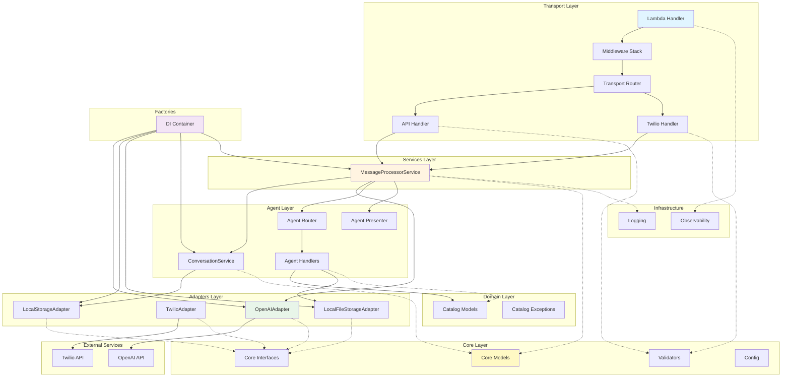

Kavak AI Commercial Agent
=========================

Bot comercial impulsado por LLMs para simular a un asesor de Kavak. Responde
preguntas sobre Kavak, recomienda autos del catalogo y calcula financiamiento.

## 📐 Arquitectura

El sistema implementa **Arquitectura Hexagonal (Ports & Adapters)** con separación clara de responsabilidades:

### Diagrama de Arquitectura



### Capas de la Arquitectura

#### 1. **Transport Layer** (`src/transport/`)
- **Responsabilidad**: Punto de entrada único para todos los transportes (API REST, WhatsApp/Twilio)
- **Componentes**:
  - `lambda_handler.py`: Handler único de Lambda que delega según el transporte
  - `router.py`: Detecta y selecciona el handler de transporte apropiado
  - `middleware.py`: Stack de middleware (error handling, validación, métricas)
  - `handlers/`: Implementaciones específicas por transporte
    - `api_handler.py`: Maneja requests JSON de API Gateway
    - `twilio_handler.py`: Maneja webhooks form-encoded de Twilio

**Patrón**: Strategy Pattern para handlers de transporte

#### 2. **Services Layer** (`src/services/`)
- **Responsabilidad**: Orquestación de la lógica de aplicación
- **Componentes**:
  - `MessageProcessorService`: Coordina el flujo completo de procesamiento de mensajes
    - Inicia turno de conversación
    - Obtiene decisión del LLM
    - Rutea a handlers
    - Humaniza respuestas
    - Persiste contexto

#### 3. **Agent Layer** (`src/agent/`)
- **Responsabilidad**: Lógica específica del agente conversacional
- **Componentes**:
  - `services/conversation.py`: Gestión de contexto de conversación
  - `router.py`: Rutea decisiones del agente a handlers específicos
  - `presenter.py`: Formatea respuestas para el usuario
  - `handlers/catalog.py`: Handlers para acciones (búsqueda, financiamiento, etc.)
  - `models.py`: Modelos de resultado de acciones

#### 4. **Adapters Layer** (`src/adapters/`)
- **Responsabilidad**: Implementaciones concretas de servicios externos
- **Componentes**:
  - `llm/openapi_adapter.py`: Adaptador para OpenAI API
  - `messaging/twilio_adapter.py`: Adaptador para Twilio WhatsApp
  - `storage/local_adapter.py`: Almacenamiento de contexto en memoria (puede extenderse a Redis/DynamoDB)
  - `files/local_adapter.py`: Almacenamiento de archivos estáticos local (puede extenderse a S3)

**Patrón**: Adapter Pattern (Ports & Adapters)

**Nota sobre FileStorage**: 
- Actualmente usa `LocalFileStorageAdapter` para leer el catálogo CSV y archivo de información desde el sistema de archivos local.
- **Para producción, se recomienda implementar `S3Adapter`** para almacenar estos archivos en S3, permitiendo:
  - Actualizaciones del catálogo sin redeployar la aplicación
  - Mejor escalabilidad y disponibilidad
  - Versionado de archivos
  - Integración con pipelines de CI/CD para actualizaciones automáticas

#### 5. **Domain Layer** (`src/domain/`)
- **Responsabilidad**: Modelos y lógica de dominio puro
- **Componentes**:
  - `catalog/models.py`: Modelos de catálogo (VehicleSearchParams, SearchResults, etc.)
  - `catalog/exceptions.py`: Excepciones de dominio

#### 6. **Core Layer** (`src/core/`)
- **Responsabilidad**: Interfaces, modelos base y configuración compartida
- **Componentes**:
  - `interfaces.py`: Interfaces (Ports) para adapters (LLMAdapter, MessagingAdapter, ContextStore, TransportHandler)
  - `models.py`: Modelos base del sistema (ConversationContext, AgentDecision, etc.)
  - `validators.py`: Validaciones centralizadas
  - `config.py`: Configuración de entorno
  - `logging.py`: Configuración de logging

#### 7. **Infrastructure Layer** (`src/infrastructure/`)
- **Responsabilidad**: Cross-cutting concerns (observabilidad, logging)
- **Componentes**:
  - `observability.py`: Configuración de AWS Lambda Powertools (logger, metrics, tracer)

#### 8. **Factories** (`src/factories/`)
- **Responsabilidad**: Dependency Injection Container
- **Componentes**:
  - `container.py`: Container singleton que provee instancias de adapters y services

### Flujo de Procesamiento

```
1. Request llega → Lambda Handler
   ↓
2. Middleware Stack (validación, error handling, métricas)
   ↓
3. Transport Router detecta tipo (API/Twilio)
   ↓
4. Transport Handler parsea request
   ↓
5. MessageProcessorService procesa:
   a. ConversationService obtiene/crea contexto
   b. LLMAdapter obtiene decisión del agente
   c. Agent Router rutea a handler específico
   d. Agent Presenter formatea respuesta
   e. LLMAdapter humaniza respuesta (opcional)
   f. Contexto se actualiza y persiste
   ↓
6. Transport Handler formatea respuesta (JSON/TwiML)
   ↓
7. Response retornada
```

### Principios de Diseño

1. **Separation of Concerns**: Cada capa tiene una responsabilidad clara
2. **Dependency Inversion**: Dependencias hacia interfaces, no implementaciones
3. **Open/Closed Principle**: Fácil agregar nuevos transportes sin modificar código existente
4. **Single Responsibility**: Cada clase tiene una única razón para cambiar
5. **Dependency Injection**: Todas las dependencias se inyectan, facilitando testing

### Extensibilidad

- **Nuevo Transporte**: Implementar `TransportHandler` y agregarlo al router
- **Nuevo LLM Provider**: Implementar `LLMAdapter`
- **Nuevo Storage de Contexto**: Implementar `ContextStore` (ej: Redis, DynamoDB)
- **Nuevo Storage de Archivos**: Implementar `FileStorage` (ej: S3, Azure Blob)
- **Nueva Acción del Agente**: Agregar handler en `agent/handlers/`

### Almacenamiento de Archivos Estáticos

El sistema maneja dos archivos estáticos:
1. **Catálogo de vehículos** (`sample_caso_ai_engineer.csv`)
2. **Información de Kavak** (`info.txt`)

Estos archivos se acceden a través de la interfaz `FileStorage`, permitiendo diferentes implementaciones:

#### Implementación Actual (Desarrollo)
- `LocalFileStorageAdapter`: Lee archivos desde el sistema de archivos local
- Configurado automáticamente en el DI Container

#### Implementación Recomendada para Producción
- **S3Adapter** (a implementar): Lee archivos desde Amazon S3
  - Ventajas:
    - Actualizaciones sin redeploy
    - Escalabilidad y alta disponibilidad
    - Versionado y backup automático
    - Integración con CI/CD para actualizaciones automáticas
  - Configuración sugerida:
    ```python
    # En container.py para producción
    def file_storage(self) -> FileStorage:
        return S3Adapter(
            bucket_name=os.getenv("CATALOG_S3_BUCKET"),
            region=os.getenv("AWS_REGION")
        )
    ```

**Nota**: La implementación de `S3Adapter` queda pendiente, pero la arquitectura ya está preparada para recibirla sin cambios en la lógica de negocio.

Quickstart
----------
1) Crear un entorno y variables de entorno:

```bash
export OPENAI_API_KEY="..."
export OPENAI_API_BASE_URL="https://api.openai.com/v1"
```

2) Instalar dependencias (ejemplo con uv):

```bash
uv sync
```

3) Probar en local (modo interactivo):

```bash
python src/tests/test_agent.py
```

API local (simulada)
--------------------
El Lambda handler vive en `src/transport/lambda_handler.py` y espera un payload:

```json
{
  "message": "Busco un Toyota Corolla 2020",
  "session_id": "demo-1"
}
```

El response incluye `message`, `success` y `vehicles` (si aplica).

Casos de uso (basados en la prueba tecnica)
------------------------------------------
1) Informacion de Kavak:
   - "Que beneficios ofrece Kavak?"
   - "Tienen garantia?"
   - "Como funciona el proceso de compra?"

2) Recomendacion de inventario:
   - "Busco un Mazda 3 2019"
   - "Quiero un coche barato"
   - "Tengo 350000 de presupuesto"

3) Manejo de lenguaje natural y typos:
   - "Busco un Toyta Corola"
   - "Quiero el mas barato"

4) Financiamiento:
   - "Opciones de financiamiento para el Toyota Corolla"
   - Enganche 20%, tasa 10% anual, plazos 3-6 anos

Pruebas locales
--------------
Script interactivo y batch en `src/tests/test_agent.py`:

```bash
python src/tests/test_agent.py
```

Tests unitarios (pytest)
------------------------
Instala dependencias de testing:

```bash
uv sync --extra test
```

Ejecutar tests:

```bash
pytest -v
```

Cobertura:

```bash
pytest --cov=. --cov-report=html --cov-report=term-missing
```

Despliegue con Serverless (AWS Lambda)
--------------------------------------
Se incluye `serverless.yml` con:
- HTTP API Gateway (POST /agent y POST /twilio/webhook)
- Variables de entorno para OpenAI, Twilio y Powertools
- Layer de Powertools via `POWERTOOLS_LAYER_ARN`
- Layer de dependencias via `serverless-python-requirements`
- Alarmas basicas con `serverless-plugin-aws-alerts`
- Logging con AWS Lambda Powertools (Logger)

Variables de entorno clave:
- `OPENAI_API_KEY`
- `OPENAI_API_BASE_URL`
- `INTEREST_RATE`
- `TWILIO_ACCOUNT_SID`
- `TWILIO_AUTH_TOKEN`
- `TWILIO_WHATSAPP_NUMBER`
- `POWERTOOLS_SERVICE_NAME`
- `POWERTOOLS_METRICS_NAMESPACE`
- `LOG_LEVEL`
- `POWERTOOLS_TRACE_DISABLED`
- `POWERTOOLS_LAYER_ARN`
- `ALERTS_TOPIC_ARN`

Roadmap sugerido (resumen)
--------------------------
Produccion:
- Infra as code + CI/CD para despliegue a Lambda/API Gateway.
- Observabilidad con trazas, metricas y alertas.
- Cache y stores para contexto (Redis/DynamoDB).

Evaluacion del agente:
- Suite de pruebas con casos reales y edge cases.
- Metricas: tasa de respuesta correcta, CSAT simulado, conversion.
- Revisiones humanas de conversaciones.

No regresiones:
- Test suite versionada con snapshots.
- Replay de conversaciones historicas.
- Tests automaticos en CI con umbrales de calidad.

Reproducibilidad
----------------
Este README funciona como manual basico de instalacion y prueba local.
